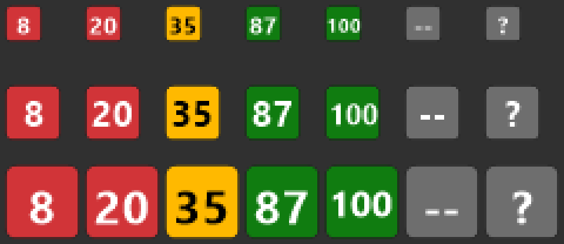

# MCHOSE V9 Pro Battery Tray

A tiny Windows tray application that shows the battery level of the **MCHOSE V9 Pro**
wireless headset, read straight from its 2.4 GHz USB dongle — without running MCHOSE HUB.

The percentage is drawn **inside the tray icon**, so you read it at a glance:



*Rendered at 16 px, 24 px and 32 px (top to bottom), magnified 4x to show the actual pixel grid.*

> 🇧🇷 [Leia em português](README.pt-BR.md)

## Why

MCHOSE HUB has to stay running to tell you the battery level. This does the same job from
a single self-contained executable that sits in the tray, costs nothing while idle, and
sends exactly one read-only HID report every 30 seconds.

## Features

- **Readable at a glance** — the charge is the icon, not a tooltip you have to hover.
- **No window, no installer** — one self-contained `.exe`, optional Windows startup entry.
- **Survives everything** — dongle unplugged, headset powered off, timeouts and malformed
  replies are all non-fatal; the tray never dies and recovers on its own.
- **Read-only by design** — it sends one known battery-query report and nothing else.
- **No dependencies** — no HID NuGet package; direct P/Invoke into `setupapi.dll`,
  `hid.dll` and `kernel32.dll`.

## Requirements

- Windows 10 or 11 (x64; the source is architecture-neutral and also publishes `win-arm64`)
- An MCHOSE V9 Pro with its 2.4 GHz dongle — USB VID:PID `291D:385D`
- [.NET SDK 8](https://dotnet.microsoft.com/download/dotnet/8.0) to build from source

> **Heads-up:** the tray menu is in Portuguese (`Atualizar agora`, `Abrir ao iniciar o
> Windows`, `Sair`). Everything else — CLI, logs, this document — is in English.

## Install

Build it yourself (there is no signed release yet):

```powershell
git clone https://github.com/rafagfran/mchose-v9-pro-battery-tray.git
cd mchose-v9-pro-battery-tray
dotnet publish src/MchoseBattery.Tray -c Release -r win-x64 --self-contained true /p:PublishSingleFile=true
```

The executable lands in
`src/MchoseBattery.Tray/bin/Release/net8.0-windows/win-x64/publish/MchoseBattery.exe`.
Copy it anywhere and run it.

**Pin it to the taskbar:** Windows hides new tray icons in the overflow menu. To keep it
always visible go to *Settings → Personalization → Taskbar → Other system tray icons* and
turn **MchoseBattery** on.

## Development

```powershell
dotnet restore
dotnet build
dotnet test tests/MchoseBattery.Core.Tests    # 56 tests, no hardware needed
dotnet run --project src/MchoseBattery.Tray
```

## Tray icon

| Charge | Colour | Icon text |
|---|---|---|
| 0–20% | red | `0`..`20` |
| 21–40% | amber | `21`..`40` |
| 41–100% | green | `41`..`100` |
| Headset off / out of range | grey | `--` |
| Dongle not found | grey | `?` |

The icon is redrawn at whatever size Windows asks for (`SystemInformation.SmallIconSize`),
so it follows DPI scaling, and it is only re-rendered when the text or colour actually
changes. The background is a filled rounded square so the glyph keeps its contrast on both
the light and the dark taskbar.

## Tray menu

| Item | Effect |
|---|---|
| `MCHOSE V9 Pro: NN%` | Current state (informational, disabled) |
| `Atualizar agora` | Force an immediate read |
| `Abrir ao iniciar o Windows` | Add/remove `MchoseBattery` under `HKCU\Software\Microsoft\Windows\CurrentVersion\Run` |
| `Sair` | Quit |

## Refresh behaviour

It is **not** a live counter. Readings happen:

- once at startup,
- every **30 seconds** thereafter,
- immediately when Windows reports a HID device arriving or leaving,
- immediately when you click `Atualizar agora`.

So the number can be up to 30 seconds stale. For a headset battery that is irrelevant —
the charge does not move 1% in half a minute — and polling harder just keeps the 2.4 GHz
radio busy for no benefit.

## Diagnostics

```powershell
MchoseBattery.exe --diagnose                    # or --list-hid: enumerate every HID collection; sends nothing
MchoseBattery.exe --inspect-device "<path>"     # capabilities of one collection; sends nothing
MchoseBattery.exe --probe-battery "<path>"      # the only mode that writes; prints request/reply in hex
```

`--probe-battery` requires the full path printed by `--diagnose`, refuses any device that
is not `291D:385D` with 64-byte input and output reports, and refuses a path that does not
identify exactly one currently-present HID collection.

Because the executable is a `WinExe`, redirect the output if your console does not attach
automatically: `MchoseBattery.exe --diagnose | Out-String`.

## Protocol

The profile below was reverse-engineered for interoperability and
**confirmed against real hardware**:

```text
VID:PID     291D:385D
Frame       64 bytes (both input and output)
Request     55 65 01 00 ... 00
Signature   55 65
Battery     reply byte 2, direct percentage 0..100
Status      reply byte 3, recorded but NOT interpreted
Timeout     500 ms
```

### Hardware capture

```text
Path:         \\?\hid#vid_291d&pid_385d&mi_00&col05#...
VID:PID:      291D:385D; Version: 0x0012
Manufacturer: C-Media Electronics Inc
Product:      MCHOSE V9 PRO
Usage Page:   0xFF90; Usage: 0x0001   (vendor-defined)
Input: 64; Output: 64; Feature: 0

Request:  55 65 01 00 ... 00
Reply:    55 65 14 02 00 ... 00
Battery:  20%; status: 0x02
```

The collection that answers is **`col05`** of interface `mi_00`, on vendor-defined
Usage Page `0xFF90`. Reply byte 2 (`0x14` = 20) carries the percentage directly.

Byte 3 (`0x02`) is deliberately left uninterpreted. One sample is not enough to claim it
means "charging", "in use", or anything else — `--probe-battery` prints it and the app
otherwise ignores it.

## Safety boundary

The app sends **only** the read-only request above, and only after a device matches the
profile. No firmware, EQ, RGB, volume, or unknown command is ever issued, and
firmware-related feature reports are deliberately out of scope. `WindowsHidTransport`
re-validates the candidate predicate and accepts only a byte-for-byte copy of the canonical request, so a caller cannot smuggle a different
payload through.

Plain V9 (non-Pro) is **not** assumed compatible. If it does not answer with a valid
signature you simply get `Headset desconectado`; the app will not go hunting for other
commands.

## States

| State | Meaning |
|---|---|
| `Dongle não encontrado` | No `291D:385D` collection with 64-byte reports |
| `Headset desconectado` | Dongle present, no valid reply (headset off, out of range, or timeout) |
| `MCHOSE V9 Pro: NN%` | Reply validated by the parser |

## Logs

`%LocalAppData%\MchoseBattery\mchose-battery.log`, capped at 256 KiB (oldest data is
dropped). Only state transitions and failures are written — a successful, unchanged poll
logs nothing.

## Project layout

```text
src/MchoseBattery.Core            native HID enumeration, protocol, transport, polling, logging
src/MchoseBattery.Tray            windowless WinForms executable, diagnostics CLI, startup registration
tests/MchoseBattery.Core.Tests    MSTest suite, no hardware required
```

## Contributing

Captures from other MCHOSE models are genuinely useful. If you own one, run
`--diagnose`, then `--probe-battery` on a `291D:385D` collection, and open an issue with
the output — especially if reply byte 3 changes while charging. That is the fastest way to
learn what the status byte actually means, and whether other models share the profile.

## Licence and disclaimer

Released under the MIT licence — see [LICENSE](LICENSE).

This is an independent project with **no affiliation with, sponsorship by, or endorsement
from MCHOSE or C-Media Electronics**. "MCHOSE" and "V9 Pro" are trademarks of their
respective owners and are used here only to identify compatible hardware.

The protocol was reverse-engineered for interoperability purposes and confirmed on
hardware owned by the author. The application issues a single
read command and no write, firmware, or configuration command. Even so, the software is
provided "as is", without warranty: running it against your device is at your own risk.
